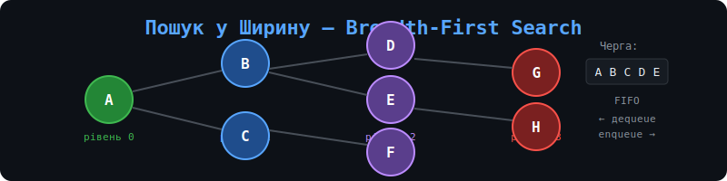

# 🔍 Пошук у ширину (Breadth-First Search)

> Повний навчальний матеріал з теорії графів та алгоритму BFS з прикладами на Python та JavaScript.



---

## 📚 Зміст

1. [Основи графів](#1-основи-графів)
2. [Представлення графів у пам'яті](#2-представлення-графів-у-памяті)
3. [BFS: алгоритм і реалізація](#3-bfs-алгоритм-і-реалізація)
4. [Приклади використання BFS у житті](#4-приклади-використання-bfs-у-житті)
5. [Запуск коду](#5-запуск-коду)
6. [Тести](#6-тести)

---

## 1. Основи графів

### 🔷 Що таке граф?

**Граф** — це математична структура, що складається з:
- **Вершин (Vertices / Nodes)** — об'єктів або точок
- **Ребер (Edges)** — зв'язків між вершинами

```
    A ── B ── C
    |         |
    D ──────── E
```

### 📐 Базові поняття

| Термін | Визначення | Приклад |
|--------|-----------|---------|
| **Вершина (Vertex)** | Вузол графу | Місто на карті |
| **Ребро (Edge)** | Зв'язок між двома вершинами | Дорога між містами |
| **Шлях (Path)** | Послідовність вершин, з'єднаних ребрами | Маршрут A → B → C |
| **Сусід (Neighbor)** | Вершина, з'єднана ребром з даною | Міста поряд |
| **Ступінь вершини (Degree)** | Кількість ребер, що виходять з вершини | Кількість доріг у місті |

### 🔀 Види графів

```
Неорієнтований         Орієнтований (Digraph)
    A — B                  A → B
    |   |                  ↑   ↓
    C — D                  D ← C

Зважений граф          Дерево (окремий випадок)
    A —5— B                    A
    |     |                  /   \
    3     2                 B     C
    |     |               /   \
    C —1— D              D     E
```

### 🛤️ Типи шляхів

- **Простий шлях** — шлях без повторення вершин
- **Цикл** — шлях, що починається і закінчується в одній вершині
- **Найкоротший шлях** — шлях з мінімальною кількістю ребер (або мінімальною вагою)

---

## 2. Представлення графів у пам'яті

Існує три основні способи зберігати граф у програмі.

### 📋 Матриця суміжності (Adjacency Matrix)

```
Граф:  A — B — C
            |
            D

     A  B  C  D
A  [ 0  1  0  0 ]
B  [ 1  0  1  1 ]
C  [ 0  1  0  0 ]
D  [ 0  1  0  0 ]
```

**Переваги:** O(1) перевірка наявності ребра  
**Недоліки:** O(V²) пам'яті, не ефективно для рідких графів

```python
# Python: матриця суміжності
adj_matrix = [
    [0, 1, 0, 0],  # A
    [1, 0, 1, 1],  # B
    [0, 1, 0, 0],  # C
    [0, 1, 0, 0],  # D
]
```

### 📌 Список суміжності (Adjacency List)

```
A → [B]
B → [A, C, D]
C → [B]
D → [B]
```

**Переваги:** O(V + E) пам'яті, ефективно для рідких графів  
**Недоліки:** O(V) перевірка наявності ребра

```python
# Python: список суміжності (найпопулярніший спосіб)
graph = {
    'A': ['B'],
    'B': ['A', 'C', 'D'],
    'C': ['B'],
    'D': ['B'],
}
```

### 🗒️ Список ребер (Edge List)

```
[ (A,B), (B,C), (B,D) ]
```

```python
# Python: список ребер
edges = [('A', 'B'), ('B', 'C'), ('B', 'D')]
```

### ⚖️ Порівняння структур

| Операція | Матриця | Список суміжності | Список ребер |
|----------|---------|-------------------|--------------|
| Пам'ять | O(V²) | O(V + E) | O(E) |
| Чи є ребро (u,v)? | O(1) | O(degree) | O(E) |
| Сусіди вершини | O(V) | O(degree) | O(E) |
| Додати ребро | O(1) | O(1) | O(1) |

> **Рекомендація:** Для більшості задач використовуйте **список суміжності** — він найбільш гнучкий і ефективний.

---

## 3. BFS: алгоритм і реалізація

### 🧠 Ідея алгоритму

BFS досліджує граф **рівень за рівнем**, як розходяться кола на воді від кинутого каменя.

```
Стартова вершина: A

Рівень 0:  A
           ↓
Рівень 1:  B  C
           ↓  ↓
Рівень 2:  D  E  F
```

### 📦 Ключова структура: черга (Queue)

BFS використовує **чергу (FIFO — First In, First Out)**:
- Додаємо сусідів у кінець черги
- Беремо вершини з початку черги

```
Черга: [A] → обробляємо A, додаємо B, C
Черга: [B, C] → обробляємо B, додаємо D
Черга: [C, D] → обробляємо C, додаємо E
Черга: [D, E] → ...
```

### 🔢 Псевдокод

```
BFS(граф, стартова_вершина):
    створити чергу Q
    позначити стартову_вершину як відвідану
    додати стартову_вершину в Q

    поки Q не порожня:
        v = взяти з початку Q
        обробити v

        для кожного сусіда w вершини v:
            якщо w не відвідана:
                позначити w як відвідану
                додати w в Q
```

### 🐍 Реалізація на Python

Дивись файл [`src/bfs_python.py`](src/bfs_python.py)

```python
from collections import deque

def bfs(graph, start):
    visited = set()
    queue = deque([start])
    visited.add(start)
    order = []

    while queue:
        vertex = queue.popleft()
        order.append(vertex)

        for neighbor in graph[vertex]:
            if neighbor not in visited:
                visited.add(neighbor)
                queue.append(neighbor)

    return order
```

### 🌐 Реалізація на JavaScript

Дивись файл [`src/bfs_javascript.js`](src/bfs_javascript.js)

```javascript
function bfs(graph, start) {
    const visited = new Set([start]);
    const queue = [start];
    const order = [];

    while (queue.length > 0) {
        const vertex = queue.shift();
        order.push(vertex);

        for (const neighbor of graph[vertex]) {
            if (!visited.has(neighbor)) {
                visited.add(neighbor);
                queue.push(neighbor);
            }
        }
    }

    return order;
}
```

### 📊 Складність алгоритму

| | Складність |
|--|--|
| **Час** | O(V + E) |
| **Пам'ять** | O(V) |

де V — кількість вершин, E — кількість ребер.

### 🗺️ Пошук найкоротшого шляху

BFS гарантує **найкоротший шлях** (за кількістю ребер) у незваженому графі.

```python
def bfs_shortest_path(graph, start, end):
    if start == end:
        return [start]

    visited = {start}
    queue = deque([[start]])  # зберігаємо шляхи, а не вершини

    while queue:
        path = queue.popleft()
        vertex = path[-1]

        for neighbor in graph[vertex]:
            new_path = path + [neighbor]
            if neighbor == end:
                return new_path
            if neighbor not in visited:
                visited.add(neighbor)
                queue.append(new_path)

    return None  # шлях не знайдено
```

---

## 4. Приклади використання BFS у житті

### 🗺️ 1. GPS-навігація та картографія

```
Задача: Знайти найближчу аптеку від вашого місця розташування

Граф:      [Ви]
          /     \
      [Вул.А]  [Вул.Б]
        |          |
    [Аптека] [Магазин]

BFS знайде аптеку через мінімальну кількість поворотів!
```

**Застосування:** Google Maps, Apple Maps для пошуку найближчих об'єктів

---

### 👥 2. Соціальні мережі

```
Задача: Знайти "ступінь знайомства" між людьми

[Ви] → [Андрій] → [Богдан] → [Цільова особа]
 ↑         ↑
 1 ступінь  2 ступені    3 ступені

LinkedIn використовує це для "Люди, яких ви можете знати"
```

**Застосування:** Facebook, LinkedIn, Twitter для рекомендацій друзів

---

### 🕸️ 3. Веб-краулери (пошукові системи)

```
Задача: Проіндексувати всі сторінки сайту

[Головна]
    ↓
[Про нас] [Продукти] [Контакти]
              ↓
         [Телефони] [Ноутбуки]

Google Googlebot обходить інтернет саме так!
```

**Застосування:** Google, Bing, DuckDuckGo

---

### 🎮 4. Ігрові AI та головоломки

```
Задача: Розв'язати кубик Рубіка або знайти вихід з лабіринту

█ █ █ █ █
█ S   █ █     S = старт
█ █   █ █     E = вихід
█     █ E
█ █ █ █ █

BFS знайде найкоротший шлях гарантовано!
```

**Застосування:** Пазли 15, головоломки, ігровий AI

---

### 🌐 5. Мережі та IT-інфраструктура

```
Задача: Знайти найкоротший шлях передачі пакету

[Ваш ПК] → [Роутер А] → [Роутер Б] → [Сервер]
                ↓
           [Роутер В] → [Сервер]  ← коротший шлях!

Протокол RIP (Routing Information Protocol) базується на BFS
```

**Застосування:** Мережеві протоколи, P2P-мережі

---

### 🧬 6. Біоінформатика

```
Задача: Знайти споріднені гени або структуру білка

[Ген A] — [Ген B]
    \         /
   [Ген C] — [Ген D]

Аналіз метаболічних мереж та еволюційних зв'язків
```

---

### ⚡ Порівняння BFS vs DFS

```
BFS (Breadth-First):          DFS (Depth-First):
Рівень за рівнем              Іде якомога глибше

    A                             A
   /|\                           /|\
  B C D  ← рівень 1           B  C  D
  |                            |
  E    ← рівень 2             E  ← іде спочатку сюди
```

| | BFS | DFS |
|--|--|--|
| **Найкоротший шлях** | ✅ Так | ❌ Ні |
| **Пам'ять** | O(W) - ширина | O(H) - глибина |
| **Повні графи** | Краще | Гірше |
| **Глибокі графи** | Гірше | Краще |

---

## 5. Запуск коду

### Python

```bash
# Клонувати репозиторій
git clone https://github.com/YOUR_USERNAME/bfs-algorithm.git
cd bfs-algorithm

# Запустити основний приклад
python src/bfs_python.py

# Запустити приклади з реального життя
python examples/social_network.py
python examples/maze_solver.py
python examples/web_crawler.py
```

### JavaScript (Node.js)

```bash
# Запустити основний приклад
node src/bfs_javascript.js

# Запустити приклади
node examples/social_network.js
```

---

## 6. Тести

```bash
# Python тести
python -m pytest tests/

# або окремо
python tests/test_bfs.py
```

---

## 📁 Структура репозиторію

```
bfs-algorithm/
├── README.md                  # Цей файл
├── src/
│   ├── bfs_python.py          # Основна реалізація BFS (Python)
│   └── bfs_javascript.js      # Основна реалізація BFS (JavaScript)
├── examples/
│   ├── social_network.py      # Соціальна мережа
│   ├── maze_solver.py         # Розв'язання лабіринту
│   └── web_crawler.py         # Веб-краулер (симуляція)
├── tests/
│   └── test_bfs.py            # Юніт-тести
└── assets/
    └── bfs-banner.svg         # Зображення для README
```

---

## 🤝 Внесок

Хочеш покращити матеріал? Відкривай [Issue](../../issues) або Pull Request!

---

## 📄 Ліцензія

MIT License — використовуй вільно для навчання і проєктів.

---

<div align="center">
  <strong>Зроблено з ❤️ для вивчення алгоритмів</strong>
</div>
